# EsperancaSolidaria.Identity API

Microsserviço responsável pela autenticação e autorização da plataforma **Conexão Solidária**.

## Responsabilidades

- Cadastro de doadores (público)
- Login com geração de JWT
- Gerenciamento de roles (GestorONG / Doador)

## Tecnologias

- .NET 10
- SQL Server (FluentMigrator)
- JWT (System.IdentityModel.Tokens.Jwt)
- BCrypt para hash de senha
- Sqids para ofuscação de IDs
- Prometheus (métricas)

## Estrutura do Projeto

```
src/
├── Backend/
│   ├── EsperancaSolidaria.Identity.API          # Controllers, Filters, Program.cs
│   ├── EsperancaSolidaria.Identity.Application  # Use Cases, Validators
│   ├── EsperancaSolidaria.Identity.Domain       # Entidades, Interfaces
│   └── EsperancaSolidaria.Identity.Infrastructure # EF Core, JWT, Migrations
└── Shared/
    ├── EsperancaSolidaria.Identity.Communication # Requests e Responses
    └── EsperancaSolidaria.Identity.Exceptions    # Exceções customizadas
```

## Endpoints

| Método | Rota | Acesso | Descrição |
|--------|------|--------|-----------|
| POST | `/user` | Público | Cadastro de doador |
| POST | `/login` | Público | Login e geração de JWT |
| PATCH | `/user` | GestorONG | Alteração de role de usuário |

## Como Rodar Localmente

### Pré-requisitos

- .NET 10 SDK
- SQL Server (local ou Docker)
- Visual Studio 2022 ou VS Code

### Configuração

1. Clone o repositório:
```bash
git clone https://github.com/MatheusRoberto-Git/EsperancaSolidaria.Identity.git
cd EsperancaSolidaria.Identity
```

2. Configure o `appsettings.Development.json`:
```json
{
  "ConnectionStrings": {
    "Connection": "Data Source=localhost\\SQLEXPRESS;Initial Catalog=EsperancaSolidariaIdentity;User Id=seu_usuario;Password=sua_senha;TrustServerCertificate=True;"
  },
  "Settings": {
    "Jwt": {
      "SigningKey": "sua_chave_minimo_32_caracteres",
      "ExpirationTimeMinutes": 1000
    },
    "IdCryptographyAlphabet": "abcdefghijklmnopqrstuvwxyzABCDEFGHIJKLMNOPQRSTUVWXYZ0123456789"
  }
}
```

3. Execute o projeto:
```bash
dotnet run --project src/Backend/EsperancaSolidaria.Identity.API
```

4. Acesse o Swagger:
```
http://localhost:5001/swagger
```

> As migrations são executadas automaticamente na inicialização.

### Rodar com Docker

```bash
docker build -t identity-api:latest .
docker run -p 5001:8080 \
  -e ConnectionStrings__Connection="Server=host.docker.internal\\SQLEXPRESS;..." \
  -e Settings__Jwt__SigningKey="sua_chave" \
  identity-api:latest
```

### Rodar com Docker Compose

Na raiz da pasta `Hackathon FIAP`:
```bash
docker-compose up identity-api
```

## Health Check

```
GET /health
```

Retorna `Healthy` quando o serviço e o banco estão operacionais.

## Métricas

```
GET /metrics
```

Expõe métricas no formato Prometheus para coleta pelo Prometheus Server.

## Kubernetes

```bash
kubectl apply -f k8s/
kubectl get pods -l app=identity-api
```

## Roles

| Role | Valor | Descrição |
|------|-------|-----------|
| GestorONG | 1 | Administrador da plataforma |
| Doador | 2 | Usuário doador |

## Variáveis de Ambiente

| Variável | Descrição |
|----------|-----------|
| `ConnectionStrings__Connection` | Connection string do SQL Server |
| `Settings__Jwt__SigningKey` | Chave de assinatura do JWT |
| `Settings__Jwt__ExpirationTimeMinutes` | Tempo de expiração do token |
| `Settings__IdCryptographyAlphabet` | Alfabeto para Sqids |

## Arquitetura

